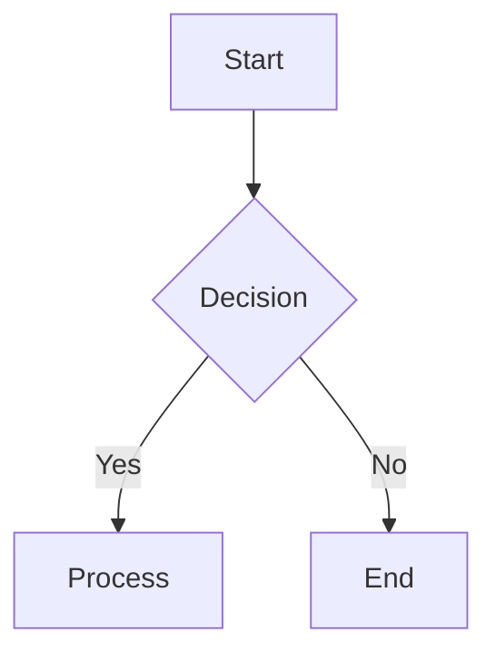

1. Mermaid diagrams. Apparently there are multiple such things you can add with ``` need to check everything and add support. basically anything that you can add in an MD file, my project should be able to render it.

